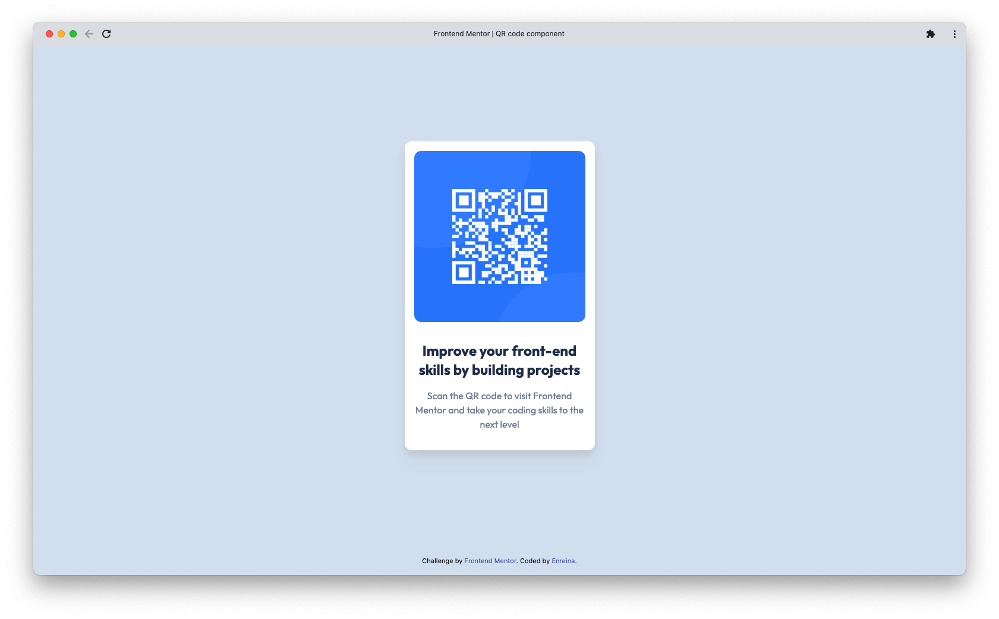
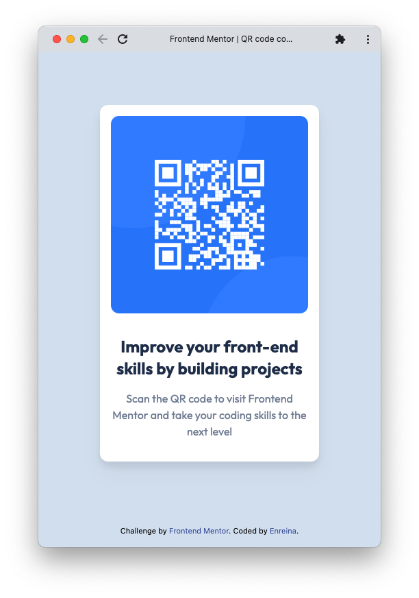

# Frontend Mentor - QR code component solution

This is a solution to the [QR code component challenge on Frontend Mentor](https://www.frontendmentor.io/challenges/qr-code-component-iux_sIO_H). Frontend Mentor challenges help you improve your coding skills by building realistic projects.

## Table of contents

- [Overview](#overview)
  - [Screenshot](#screenshot)
  - [Links](#links)
- [My process](#my-process)
  - [Built with](#built-with)
  - [What I learned](#what-i-learned)
  - [Takeaways](#takeaways)
  - [Future Improvement](#future-improvement)
  - [Useful resources](#useful-resources)
- [Author](#author)
- [Acknowledgments](#acknowledgments)

## Overview

### Screenshot

**Desktop**



**Mobile**



### Links

- Solution URL: https://github.com/enreina/frontend-mentor-qr-code-component
- Live Site URL: https://enreina.github.io/frontend-mentor-qr-code-component

## My process

### Built with

- [HTML](https://developer.mozilla.org/en-US/docs/Glossary/HTML)
- [Tailwind CSS](https://tailwindcss.com/)

### What I learned

Overall, I tried to work on the page from the outer part (i.e. grey background) to the inner part (i.e. the QR code image and the text). For layout sizing (width, height, margin, and padding), I checked the size/gap lengths on the provided design JPGs, and try to find the appropriate Tailwind CSS utility class closest to the intended size. I tried to avoid custom size as much as possible.

- **Using Tailwind with vanilla HTML**

  Because this is my first time working on a Frontend Mentor challenge and my first time to use Tailwind CSS, I use Tailwind's [Play CDN](https://tailwindcss.com/docs/installation/play-cdn) to work on the solution rapidly. Ideally, the Play CDN should not be used for real production project.

- **Using custom colors**

  Tailwind has a predefined default color palette we can use out of the box. For this QR Code challenge, I followed the colors stated in the [Style Guide](./style-guide.md) and add the followings to my `tailwind.config`:

  ```
  tailwind.config = {
      theme: {
        extend: {
          colors: {
            'light-gray': 'hsl(212, 45%, 89%)',
            'grayish-blue': 'hsl(220, 15%, 55%)',
            'dark-blue': 'hsl(218, 44%, 22%)',
          },
        }
      }
    }
  ```

- **Setting background color of a div**

  Basically, I refer to the Tailwind CSS docs on [Background Color](https://tailwindcss.com/docs/background-color), but uses the custom color defined in the `tailwind.config`, e.g.:

  ```
  <div class="bg-light-gray>
    ...
  </div>
  ```

- **Centering a div horizontally and vertically**

  Classic challenge for a frontend engineer. Well, I tried to figure it how to do it by only referring to the Tailwind CSS's documentation, but.. I gave up and just took a shortcut by googling "centering a div with Tailwind CSS".

  I found this resource: [Tailwind center div with flex center](https://daily-dev-tips.com/posts/center-elements-with-tailwind-css/#2-tailwind-center-div-with-flex-center) and applied it to my outer div (with the `bg-light-gray` class):

  ```
  <div class="bg-light-gray flex flex-col items-center justify-center h-screen">
    ...
  </div>
  ```

- **Using custom font from Google Fonts in Tailwind CSS**

  I went to the Google Fonts of the font described in the [Style Guide](./style-guide.md): [Outfit](https://fonts.google.com/specimen/Outfit), and selected `Regular 400` and `Bold 700`. Then, I proceed to copy the provided `<link>` code and paste it to the <head> section of my `index.html`

- **Setting radius of rounded borders of a div**

  As simple as adding `rounded-[size]` class to the intended `div`. For this challenge, I chose to use the `rounded-xl` utility class provided by Tailwind CSS. The rounded border is needed for the white div and the QR image:

  ```
  <div class="bg-white rounded-xl ...">
    
    ...
  </div>
  ```

- **Adding drop-shadow**

  Again, it's a simple task of adding the utility class `drop-shadow-{amount}` to the element. For this challenge I added `drop-shadow-xl`.

- **Setting margin and padding**

- **Make a footer stick at the bottom**

  Again, I _cheated_ by googling "sticky footer tailwind css". The resource I use as a reference is [here](https://radu.link/make-footer-stay-bottom-page-tailwind-css/). As the the gray div already has `flex-col` and `h-screen`, I just needed to add the `mt-auto` (equals to `margin-top: auto`) to the attribution div:

  ```
  <div class="bg-light-gray flex flex-col items-center justify-center h-screen">
    ...
    <div class="attribution mt-auto">
      ...
    </div>
  </div>
  ```

### Takeaways

Documentation of Tailwind CSS is very easy to navigate as a reference, but I imagine as we use Tailwind CSS more often, we'll get used to the utility class names and pattern. So far, my first impression on Tailwind CSS is great, and I would like to try to use it for real projects.

Another takeaway: I need to brush up on my flex / layout / grid stuff as I still need to look up on how to center a div :)

### Future Improvement

It's not part of the challenge but I might expand the solution to use React and add a feature enhancement to generate the QR code dynamically by inputting a URL to a text field.

### Useful resources

- [Tailwind CSS Documentation](https://tailwindcss.com/docs/installation)
- [Tailwind center div with flex center](https://daily-dev-tips.com/posts/center-elements-with-tailwind-css/#2-tailwind-center-div-with-flex-center)
- [How to Make Footer Stay at Bottom of Page with Tailwind CSS](https://radu.link/make-footer-stay-bottom-page-tailwind-css/)

## Author

- Website - [Enreina](https://enreina.com)
- Frontend Mentor - [@enreina](https://www.frontendmentor.io/profile/enreina)
- Twitter - [@enreina\_](https://www.twitter.com/enreina_)

## Acknowledgments

Thank you to the team behind Tailwind CSS, and author(s) of all the resources I've found on the internet :)

Thank you as well for the team behind [Frontend Mentor](https://www.frontendmentor.io/) for providing a first nice challenge. I can't wait to work on the next challenge.
